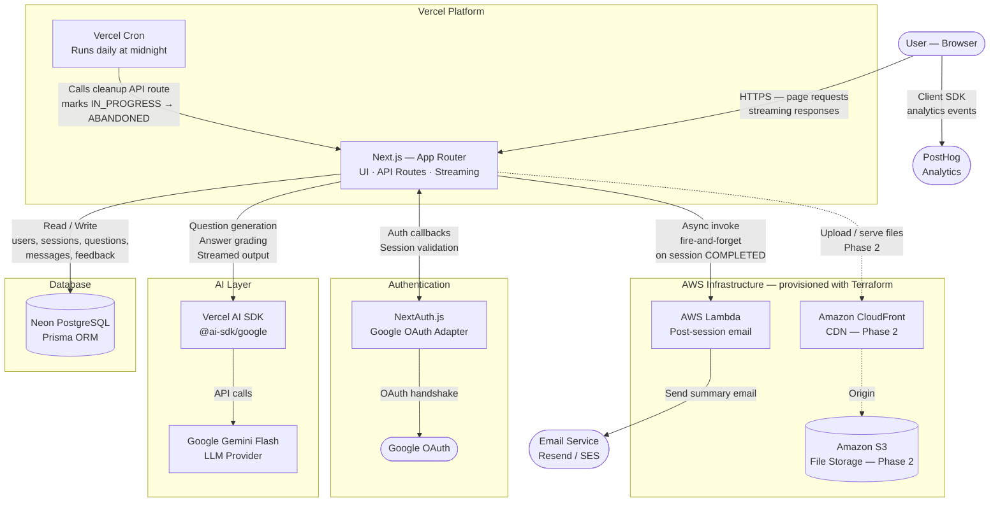

# System Architecture

**Project:** MockMate  
**Last Updated:** 2026-06-03  
**Status:** Final — MVP architecture with Phase 2 components shown

---

## Architecture Diagram

Solid arrows show MVP data flows. Dashed arrows show Phase 2 flows (not yet built).

---

## Component Reference

| Component | Role | Where it runs |
|---|---|---|
| **Next.js — App Router** | Serves the UI and handles all API logic — session creation, chat exchanges, grading, auth callbacks, cleanup | Vercel — serverless functions + edge |
| **Vercel Cron** | Runs a daily scheduled job that calls the cleanup API route — marks sessions older than 24h as ABANDONED | Vercel — managed scheduler |
| **Neon PostgreSQL** | Primary database — stores all user data, sessions, questions, messages, and feedback | Neon — serverless Postgres |
| **Prisma ORM** | Type-safe database client — runs inside Next.js, translates queries to SQL | Inside Next.js |
| **Vercel AI SDK** | LLM abstraction layer — all AI calls go through this, never the provider SDK directly | Inside Next.js API routes |
| **Google Gemini Flash** | LLM provider — generates interview questions, evaluates follow-ups, produces grading matrix JSON | Google Cloud |
| **NextAuth.js** | Authentication library — handles Google OAuth flow, manages sessions, writes user records to DB | Inside Next.js |
| **Google OAuth** | Identity provider — authenticates users via their Google account | Google |
| **AWS Lambda** | Runs post-session email generation asynchronously — invoked by Next.js on session completion, does not block the feedback page | AWS |
| **Amazon S3** | Object storage for user-uploaded files — resumes (PDF) and audio recordings — Phase 2 only | AWS |
| **Amazon CloudFront** | CDN in front of S3 — serves stored files to users with low latency — Phase 2 only | AWS edge network |
| **PostHog** | Product analytics — client SDK fires events (session_started, session_completed, feedback_rated) from the browser | PostHog Cloud |
| **Email Service** | Sends post-session summary emails — invoked by Lambda | Resend or AWS SES |

---

## Key Data Flows

**1. User loads the app**  
Browser → Next.js (Vercel serves the page) → Next.js checks for active session via NextAuth → if authenticated, queries Neon for IN_PROGRESS sessions → renders Dashboard with or without resume banner

**2. Google login**  
Browser → Next.js → NextAuth initiates OAuth → redirects to Google → Google returns token → NextAuth callback creates or updates User record in Neon via Prisma → session cookie set

**3. Starting an interview**  
Browser submits New Session form → Next.js API route validates input (character limits) → creates Session row in Neon (status: IN_PROGRESS) → creates first Question row → calls Gemini via Vercel AI SDK to generate question 1 → streams response back to browser

**4. Submitting an answer**  
Browser submits answer → Next.js API route saves answer as Message to Neon first (before LLM call) → calls Gemini via Vercel AI SDK with full context (system prompt + resume + JD + conversation history) → Gemini streams response → response saved as Message to Neon → Question evaluation note updated → response streams to browser in real time

**5. Session completion**  
Browser triggers end (5 questions complete or user ends early) → Next.js API route calls Gemini with all evaluation notes to generate grading matrix JSON → Feedback row created in Neon → Session status updated to COMPLETED → Next.js asynchronously invokes Lambda (fire-and-forget) → Lambda generates summary email content → sends via email service → Next.js returns grading data to browser → Feedback page renders

**6. Abandoned session cleanup**  
Vercel Cron fires at midnight → calls Next.js cleanup API route → Prisma query finds sessions with status IN_PROGRESS and last_active_at older than 24 hours → updates status to ABANDONED

**7. User resumes a session**  
Browser loads Dashboard → Next.js queries Neon for IN_PROGRESS sessions → resume banner rendered → user clicks Resume → Next.js loads session, questions, and messages from Neon → Interview screen hydrates from DB state, not empty

---

## Infrastructure as Code — Terraform

All AWS resources (Lambda, S3, CloudFront, IAM roles and policies) are provisioned using Terraform configuration files stored in `/infra/`. This means:

- No clicking around the AWS console to create resources
- Infrastructure is version-controlled alongside the application code
- The same configuration can be applied to a staging or production environment by changing variable values

Terraform manages: Lambda function definition and deployment package, S3 bucket with access policies, CloudFront distribution pointed at S3, IAM role for Lambda with least-privilege permissions.

---

## Phase 2 Additions

When Phase 2 begins, these components are added to the live architecture:

| Addition | What changes |
|---|---|
| S3 + CloudFront | Resume PDF upload replaces plain text textarea. Files stored in S3, served via CloudFront. Lambda gains access to S3 for reading uploaded resumes. |
| Gemini Files API | PDFs uploaded to S3 are passed to Gemini via the Files API — no custom parsing code needed |
| Stripe | Billing layer added between User and session creation — session creation checks subscription status before proceeding |
| Audio recording | Browser records audio during interview → uploaded to S3 → transcribed via Whisper API → fed to grading pipeline |
