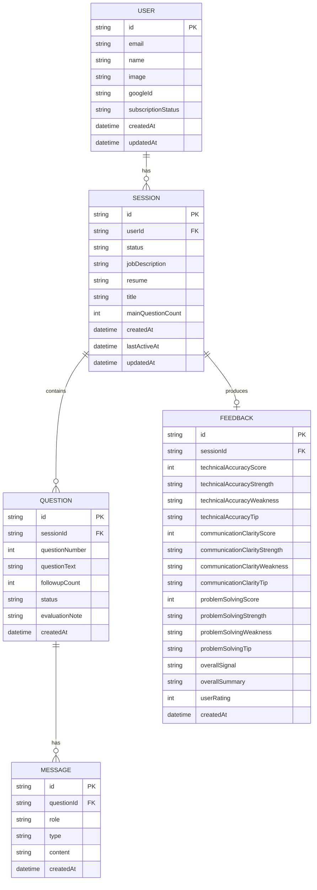

# Entity Model — Phase 2 Analysis

**Project:** MockMate  
**Last Updated:** 2026-06-02  
**Status:** Final

This document defines the data model for MVP. It is the direct input for the Prisma schema in Phase 3. Every entity here maps to one database table. Every field listed here maps to one column.

---

## 1. Entity Relationship Diagram

---

## 2. Entity Definitions

### User

Stores authenticated users. Created on first Google login via NextAuth.

| Field | Type | Constraints | Description |
|---|---|---|---|
| id | String | PK, cuid | Auto-generated unique identifier |
| email | String | Unique, required | Google account email |
| name | String | Required | Display name from Google |
| image | String | Nullable | Avatar URL from Google |
| googleId | String | Unique, required | Google OAuth subject ID |
| subscriptionStatus | Enum | Default: FREE | Stub for Phase 2 Stripe integration |
| createdAt | DateTime | Auto | Account creation timestamp |
| updatedAt | DateTime | Auto | Last update timestamp |

---

### Session

One record per interview attempt. Created when the user submits the New Session form. Persists through all states until marked COMPLETED or ABANDONED.

| Field | Type | Constraints | Description |
|---|---|---|---|
| id | String | PK, cuid | Auto-generated unique identifier |
| userId | String | FK → User, required | The user who owns this session |
| status | Enum | Default: IN_PROGRESS | Current state of the session |
| jobDescription | String | Required, max 6,000 chars | JD pasted by the user |
| resume | String | Required, max 6,000 chars | Resume text pasted by the user |
| title | String | Required, max 100 chars | Short human-readable label for the session — user fills this in on the New Session form (e.g. "Frontend Engineer at Spotify") |
| mainQuestionCount | Int | Default: 0, max: 5 | How many main questions have been asked |
| createdAt | DateTime | Auto | When the session was started |
| lastActiveAt | DateTime | Auto-updated | Updated on every exchange — used by the cleanup cron |
| updatedAt | DateTime | Auto | Last update timestamp |

---

### Question

One record per main interview question within a session. Maximum 5 per session. Created by the AI at the start of each new main question.

| Field | Type | Constraints | Description |
|---|---|---|---|
| id | String | PK, cuid | Auto-generated unique identifier |
| sessionId | String | FK → Session, required | The session this question belongs to |
| questionNumber | Int | Required, 1–5 | Position of this question in the session |
| questionText | String | Required | The AI's question text |
| followupCount | Int | Default: 0, max: 2 | How many follow-ups have been issued for this question |
| status | Enum | Default: RESOLVED | Set to UNRESOLVED if both follow-ups are exhausted without a satisfactory answer |
| evaluationNote | String | Nullable | AI's hidden assessment of the user's answer — appended after each question, used to generate the grading matrix |
| createdAt | DateTime | Auto | When this question was generated |

---

### Message

One record per individual message in the interview chat. A single Question produces between 2 and 6 messages depending on how many follow-ups occur.

| Field | Type | Constraints | Description |
|---|---|---|---|
| id | String | PK, cuid | Auto-generated unique identifier |
| questionId | String | FK → Question, required | The question this message belongs to |
| role | Enum | Required | Who sent this message: AI or USER |
| type | Enum | Required | The kind of message — see enum definitions |
| content | String | Required | The message text |
| createdAt | DateTime | Auto | When the message was created |

---

### Feedback

One record per completed or early-exited session. Generated by the AI from the `evaluationNote` fields across all Questions in the session. Never created for ABANDONED sessions.

| Field | Type | Constraints | Description |
|---|---|---|---|
| id | String | PK, cuid | Auto-generated unique identifier |
| sessionId | String | FK → Session, unique | One feedback record per session |
| technicalAccuracyScore | Int | Required, 1–5 | Score for technical accuracy dimension |
| technicalAccuracyStrength | String | Required | One written strength observation |
| technicalAccuracyWeakness | String | Required | One written weakness observation |
| technicalAccuracyTip | String | Required | One actionable improvement tip |
| communicationClarityScore | Int | Required, 1–5 | Score for communication clarity dimension |
| communicationClarityStrength | String | Required | One written strength observation |
| communicationClarityWeakness | String | Required | One written weakness observation |
| communicationClarityTip | String | Required | One actionable improvement tip |
| problemSolvingScore | Int | Required, 1–5 | Score for problem-solving approach dimension |
| problemSolvingStrength | String | Required | One written strength observation |
| problemSolvingWeakness | String | Required | One written weakness observation |
| problemSolvingTip | String | Required | One actionable improvement tip |
| overallSignal | Enum | Required | Final hiring signal |
| overallSummary | String | Required | 2-sentence overall summary |
| userRating | Int | Nullable, 1–5 | User's rating of the feedback quality — collected on the feedback page |
| createdAt | DateTime | Auto | When feedback was generated |

---

## 3. Enum Definitions

| Enum | Values | Used on |
|---|---|---|
| SubscriptionStatus | `FREE` `PRO` | User.subscriptionStatus |
| SessionStatus | `IN_PROGRESS` `COMPLETED` `ABANDONED` | Session.status |
| QuestionStatus | `RESOLVED` `UNRESOLVED` | Question.status |
| MessageRole | `AI` `USER` | Message.role |
| MessageType | `MAIN_QUESTION` `USER_ANSWER` `FOLLOWUP_QUESTION` `FOLLOWUP_ANSWER` | Message.type |
| OverallSignal | `HIRE` `NO_HIRE` `STRONG_HIRE` | Feedback.overallSignal |

---

## 4. Key Design Notes

**Why Question is its own entity, not a JSON field on Session**  
`followupCount` and `status` are per-question values that change independently during the session. Storing questions as a JSON array on Session would make it impossible to update a single question's state without rewriting the entire array. Normalized is the right call here.

**Why evaluationNote lives on Question, not Session**  
The AI generates one evaluation note per main question. Attaching it to the Question entity keeps the assessment co-located with the question it describes. The grading matrix is generated by reading all 5 evaluation notes at session end — not by re-processing the conversation from scratch.

**Why Feedback is separate from Session**  
Session tracks the process. Feedback is the output. They have different lifecycles: Session is created at the start, Feedback is created at the end. Separating them keeps each table focused and makes it easy to query sessions without loading the full grading matrix.

**subscriptionStatus on User is a Phase 2 stub**  
The field exists so the Stripe integration in Phase 2 has a column to write to. For MVP, every user is `FREE`. No billing logic is implemented.

**title on Session surfaces from wireframe review**  
The wireframe design review (Phase 3) revealed that session cards on the Dashboard need a human-readable label. The raw `jobDescription` text is too long to display on a card. `title` is a short, user-provided string filled in on the New Session form — added to the entity model during Phase 3 as a result of the design review.
