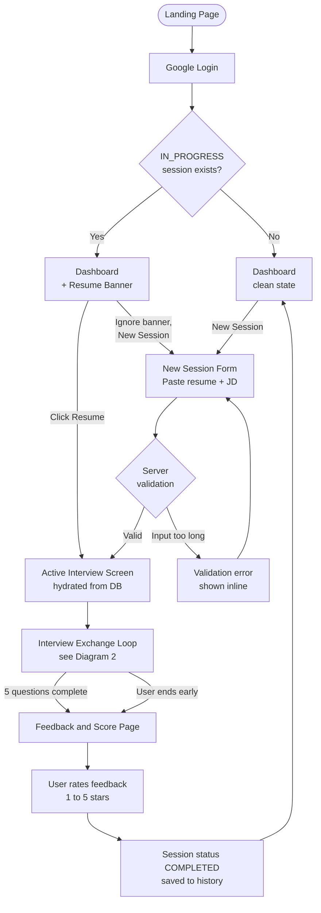
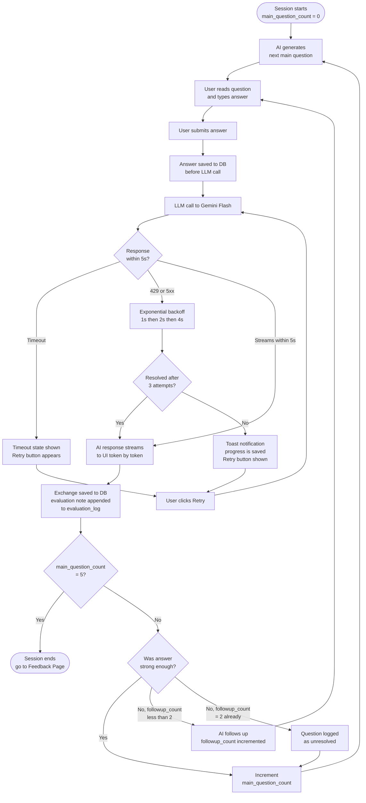
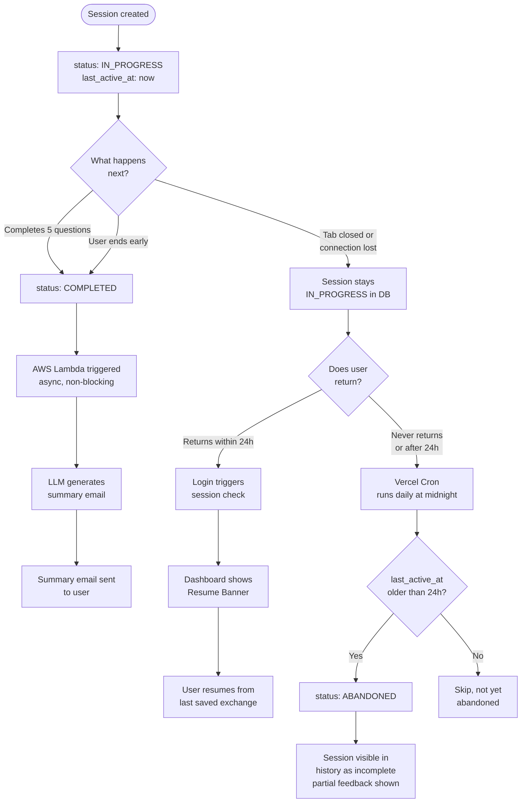

# User Flow — Phase 2 Analysis

**Project:** MockMate  
**Last Updated:** 2026-06-02  
**Status:** Final

This document maps every user path through the application — not just the happy path. It is the reference for both UI design (Phase 3 wireframes) and backend implementation (Phase 4). Every flow here is derived from decisions documented in the PRD and ADRs.

---

## 1. Main User Journey

Covers all entry points into the application and the full session lifecycle from the user's perspective.

**Key branching points:**
- A returning user with an unfinished session sees a resume banner on the dashboard. They can resume or start fresh — both options are available.
- Input validation happens server-side before the session is created. The form does not submit until the server confirms the inputs are within the character limits defined in the PRD.
- Early exit and normal completion both land on the same feedback page. Grading is generated from whatever was logged in `evaluation_log` at the point the session ends.

---

## 2. Interview Exchange Loop

Covers what happens during an active session — per-message detail including follow-up logic, timeouts, and retry flows.

**Key rules encoded in this flow:**
- The answer is written to the database **before** the LLM call. If the call fails, the answer is never lost.
- `followup_count` resets to 0 on every new main question. It only tracks follow-ups within the current question.
- A question marked unresolved still increments `main_question_count` and advances the session. The AI never loops on a single question more than twice.
- Retry always re-sends to the LLM — the saved answer in the DB is the source of truth, so no user input is lost between retries.

---

## 3. Session Lifecycle and Async Flows

Covers what happens outside the active browser session — background jobs, abandoned state, and post-session processing.

**Key design decisions visible in this flow:**
- Lambda is triggered only on `COMPLETED` sessions — it sends a post-session summary email. This is an async, non-blocking operation. The feedback page loads immediately; the email arrives separately.
- The Vercel Cron job does not delete sessions — it only flips the status. Abandoned sessions remain in history so the user can see the partial record.
- There is no server-sent event or WebSocket involved in the resume flow. On login, the Next.js dashboard page queries the DB for `IN_PROGRESS` sessions and conditionally renders the banner. Simple request-response is sufficient.

---

## 4. Non-Happy Path Reference

Quick reference for every deviation from the happy path, with the rule that governs it.

| Path | Trigger | System behaviour | User sees |
|---|---|---|---|
| Resume an unfinished session | `IN_PROGRESS` session found on login | Interview screen hydrated from DB state | Resume banner on dashboard |
| Input too long | Resume or JD exceeds character limit | Server returns 400 before session is created | Inline validation error on the form |
| AI timeout | No stream starts within 5 seconds | Client shows timeout state | Retry button, no data lost |
| AI rate limit or server error | 429 or 5xx from Gemini | Exponential backoff, 3 attempts | Retry button with toast after final failure |
| Vague answer, first follow-up | Answer under 40 words or lacks technical content | AI challenges, `followup_count` incremented | AI follow-up question |
| Vague answer, second follow-up | First follow-up also produced weak answer | AI gives light nudge, `followup_count` = 2 | AI follow-up with hint |
| Unresolved question | Both follow-ups exhausted, still weak | Question logged as unresolved, session advances | AI moves to next question |
| Early exit | User clicks End Interview Early | Grading generated from `evaluation_log` so far | Feedback page with partial session results |
| Prompt injection attempt | User submits override attempt | System prompt isolation holds, AI stays in character | Normal AI response |
| Session abandoned | `IN_PROGRESS` for more than 24 hours | Vercel Cron flips status to `ABANDONED` | Session shown as incomplete in history |
