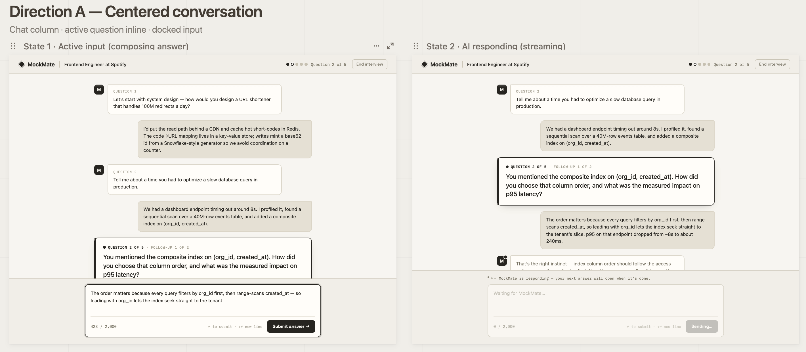
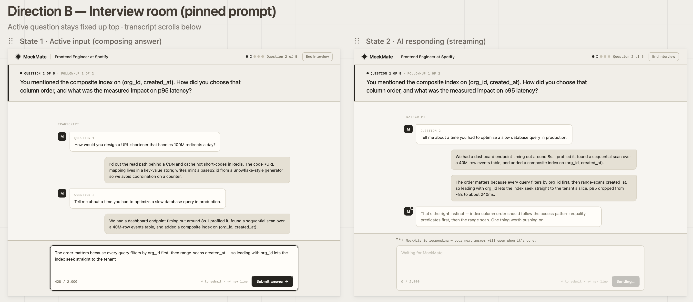

# Wireframes — Phase 3 Design

**Project:** MockMate  
**Last Updated:** 2026-06-03  
**Status:** In Progress — Dashboard complete, Interview and Feedback screens pending

---

## Dashboard Screen

Two directions were explored. Both show State 1 (returning user with an unfinished session) and State 2 (new user, empty state).

---

### Direction A — Banner-led

Full-width resume strip · 2-column card grid

**What this direction does:**
- Resume banner sits prominently at the top of the content area — immediately visible, impossible to miss
- "Welcome back, [name]" greeting + "New interview" button establish context and primary action
- Session history is the main content — cards in a 2-column grid with bar meter scores
- Empty state (State 2) uses a dashed container with a 3-step onboarding explanation and a single CTA

---

### Direction B — Hero-led

Split hero (new + resume) · history below

**What this direction does:**
- Split hero panel: "Start Fresh" on the left, unfinished session on the right — treats both actions as equal priority
- "Practice the interview before it counts" headline in State 2 is strong marketing copy
- HOW IT WORKS strip separates onboarding context from session history
- User dropdown (account settings, logout) shown explicitly in the nav

---

## Design Review Notes

| Observation | Direction A | Direction B |
|---|---|---|
| Resume banner visibility | Prominent strip, first thing seen | Split hero gives it equal weight but less urgency |
| Returning user experience | History is primary content, no wasted space | Hero takes up vertical space before history |
| New user onboarding | 3-step explanation inside dashed container | "Practice before it counts" headline + HOW IT WORKS strip |
| Nav dropdown | Not shown in wireframe | Shown with account settings + billing |
| Information hierarchy | Task-first, clean | Marketing-first, bigger visual impact |

**Issues identified during review:**

1. Both directions show "6 of 10 questions" on the resume banner — wrong. Sessions have exactly **5 main questions**. Copy must be corrected in implementation.
2. Session cards require a human-readable label (e.g., "Frontend Engineer at Spotify") — this revealed a missing `title` field on the Session entity. Entity model has been updated.
3. Direction B shows "Billing" in the nav dropdown — Stripe is deferred to Phase 2. MVP dropdown should show only Account settings and Log out.

---

## Decision

**Direction A — confirmed.**

Direction A's information architecture serves returning users better. The dashboard is a screen people open repeatedly — not a landing page. History is the product for returning users, and Direction A surfaces it immediately without scrolling past a hero section.

The one element worth noting from Direction B: the "Practice the interview before it counts" copy is strong. Reserved for the landing page (Phase 2), not the dashboard.

---

---

## Active Interview Screen

Two directions were explored. Both show State 1 (user composing an answer) and State 2 (AI streaming a response).

---

### Direction A — Centered Conversation

Chat column · active question inline · docked input

**What this direction does:**
- Full conversation history is visible — user sees the exchange that led to the current question, giving context for follow-ups
- Current active question rendered inline with a black border — unmissable without breaking the conversation flow
- "QUESTION 2 OF 5 · FOLLOW-UP 1 OF 2" label on the current question tells the user exactly where they are
- Dot progress indicator (● ○ ○ ○ ○) in the top bar is visually clean and immediate
- Docked input at the bottom: textarea, "428 / 2,000" character counter, keyboard hint ("← to submit · ↵= new line"), Submit button
- State 2: input disabled with "Waiting for MockMate..." placeholder and grayed-out "Sending..." button while AI generates

---

### Direction B — Interview Room (Pinned Prompt)

Active question stays fixed up top · transcript scrolls below

**What this direction does:**
- Current question pinned as a fixed header — always visible regardless of scroll position
- Conversation history lives in a "TRANSCRIPT" section below the pinned question
- Clear separation between "what am I answering" and "what was said before"
- Same docked input and streaming state as Direction A

---

## Design Review Notes — Active Interview

| Observation | Direction A | Direction B |
|---|---|---|
| Current question visibility | Inline black-bordered box — clear, contextual | Pinned header — always visible but decontextualised |
| Conversation context | Full history visible above current question | History separated into transcript section below |
| Follow-up clarity | "FOLLOW-UP 1 OF 2" label on current question | Same label on pinned header |
| Progress indicator | Dot indicators (● ○ ○ ○ ○) — clean | Same dot indicators |
| Streaming state | Input disabled, "Waiting for MockMate..." | Same pattern |
| Interview feel | Conversational — follow-ups feel connected to context | More formal — question always in focus |

**Issues identified during review:**

1. "End interview" button is correctly placed (small, text-only, top right — escape hatch feel) but must trigger a confirmation modal in implementation: "End this session early? Your progress so far will be graded." Not a wireframe concern — required implementation note.
2. Streaming indicator copy ("MockMate is responding — your next answer will open when it's done.") is too verbose. Simplify to "MockMate is responding..." in implementation.
3. Error states (retry toast, 5-second timeout, connection loss) are not shown — expected. These are defined in the PRD error states section and handled in implementation.

---

## Decision — Active Interview

**Direction A — confirmed.**

Direction B's pinned question seems safer at first glance, but decontextualises follow-ups. When the AI asks "you mentioned the composite index — how did you choose that column order?", seeing the previous answer above it is essential for understanding what triggered the follow-up. Direction A keeps the full exchange visible, and the inline bordered box makes the current question unmissable anyway.

One element borrowed from Direction B: the bolder, larger rendering of the current question. The current question box in implementation should use slightly more visual weight (larger font, more padding) than the historical messages.

---

## Screens Remaining

| Screen | Status |
|---|---|
| Dashboard | Done — Direction A selected |
| Active Interview | Done — Direction A selected |
| Feedback & Score Page | Not started |
