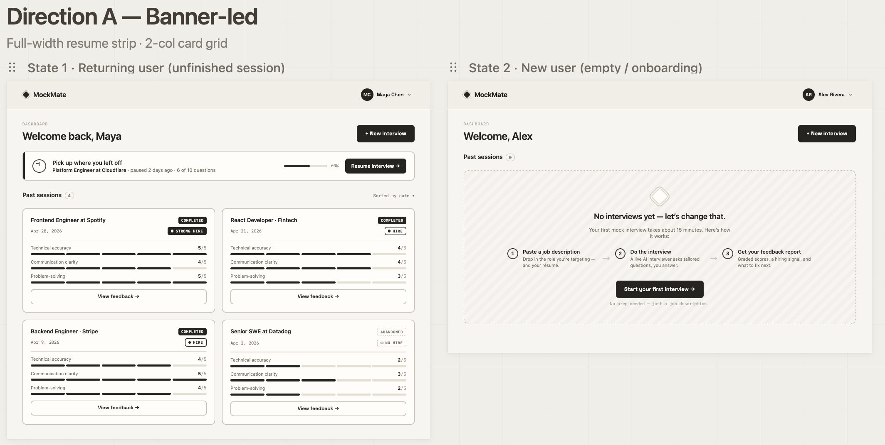
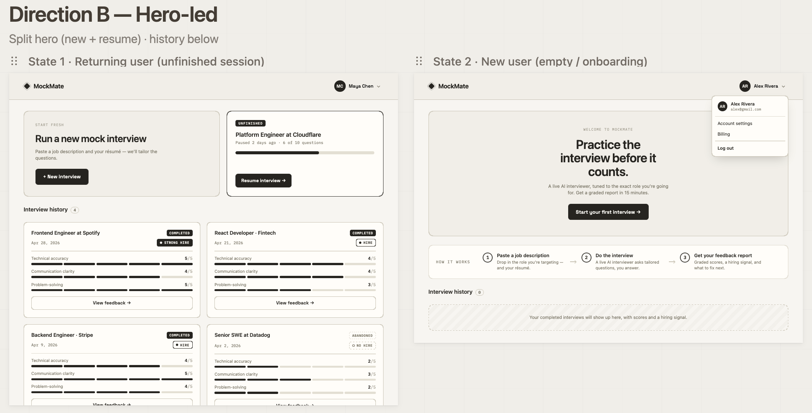

# Wireframes — Phase 3 Design

**Project:** MockMate  
**Last Updated:** 2026-06-03  
**Status:** In Progress — Dashboard complete, Interview and Feedback screens pending

---

## Dashboard Screen

Two directions were explored. Both show State 1 (returning user with an unfinished session) and State 2 (new user, empty state).

---

### Direction A — Banner-led

Full-width resume strip · 2-column card grid

**What this direction does:**
- Resume banner sits prominently at the top of the content area — immediately visible, impossible to miss
- "Welcome back, [name]" greeting + "New interview" button establish context and primary action
- Session history is the main content — cards in a 2-column grid with bar meter scores
- Empty state (State 2) uses a dashed container with a 3-step onboarding explanation and a single CTA

---

### Direction B — Hero-led

Split hero (new + resume) · history below

**What this direction does:**
- Split hero panel: "Start Fresh" on the left, unfinished session on the right — treats both actions as equal priority
- "Practice the interview before it counts" headline in State 2 is strong marketing copy
- HOW IT WORKS strip separates onboarding context from session history
- User dropdown (account settings, logout) shown explicitly in the nav

---

## Design Review Notes

| Observation | Direction A | Direction B |
|---|---|---|
| Resume banner visibility | Prominent strip, first thing seen | Split hero gives it equal weight but less urgency |
| Returning user experience | History is primary content, no wasted space | Hero takes up vertical space before history |
| New user onboarding | 3-step explanation inside dashed container | "Practice before it counts" headline + HOW IT WORKS strip |
| Nav dropdown | Not shown in wireframe | Shown with account settings + billing |
| Information hierarchy | Task-first, clean | Marketing-first, bigger visual impact |

**Issues identified during review:**

1. Both directions show "6 of 10 questions" on the resume banner — wrong. Sessions have exactly **5 main questions**. Copy must be corrected in implementation.
2. Session cards require a human-readable label (e.g., "Frontend Engineer at Spotify") — this revealed a missing `title` field on the Session entity. Entity model has been updated.
3. Direction B shows "Billing" in the nav dropdown — Stripe is deferred to Phase 2. MVP dropdown should show only Account settings and Log out.

---

## Decision

**Direction A — confirmed.**

Direction A's information architecture serves returning users better. The dashboard is a screen people open repeatedly — not a landing page. History is the product for returning users, and Direction A surfaces it immediately without scrolling past a hero section.

The one element worth noting from Direction B: the "Practice the interview before it counts" copy is strong. Reserved for the landing page (Phase 2), not the dashboard.

---

## Screens Remaining

| Screen | Status |
|---|---|
| Dashboard | Done — Direction A selected |
| Active Interview | Not started |
| Feedback & Score Page | Not started |
